# Quantities
- BitTorqueQuantity:BitTorqueQuantity_0
- TorqueQuantity:TorqueQuantity_0
- BlockAccelerationQuantity:BlockAccelerationQuantity_0
- AccelerationQuantity:AccelerationQuantity_0
- BlockPositionQuantity:BlockPositionQuantity_0
- LengthQuantity:LengthQuantity_0
- BlockVelocityQuantity:BlockVelocityQuantity_0
- VelocityQuantity:VelocityQuantity_0
- DepthQuantity:DepthQuantity_0
- EMWQuantity:EMWQuantity_0
- MassDensityQuantity:MassDensityQuantity_0
- FlowRateQuantity:FlowRateQuantity_0
- VolumetricRateQuantity:VolumetricRateQuantity_0
- FluidDensityInQuantity:FluidDensityInQuantity_0
- FluidTemperatureInQuantity:FluidTemperatureInQuantity_0
- TemperatureQuantity:TemperatureQuantity_0
- HookloadQuantity:HookloadQuantity_0
- MassQuantity:MassQuantity_0
- PumpRateQuantity:PumpRateQuantity_0
- FrequencyQuantity:FrequencyQuantity_0
- SPPQuantity:SPPQuantity_0
- PressureQuantity:PressureQuantity_0
- SurfaceRPMQuantity:SurfaceRPMQuantity_0
- SurfaceTorqueQuantity:SurfaceTorqueQuantity_0
- TopOfStringForceQuantity:TopOfStringForceQuantity_0
- ForceQuantity:ForceQuantity_0
- TVDQuantity:TVDQuantity_0
- WOBQuantity:WOBQuantity_0
- Resistivity:Resistivity_0
- ElectricResistivityQuantity:ElectricResistivityQuantity_0
- RockDensityQuantity:RockDensityQuantity_0
- FormationPorosityQuantity:FormationPorosityQuantity_0
- ProportionQuantity:ProportionQuantity_0
- BitTorqueQuantity_0 IsObservableFrom TorqueQuantity_0
- BlockAccelerationQuantity_0 IsObservableFrom AccelerationQuantity_0
- BlockPositionQuantity_0 IsObservableFrom LengthQuantity_0
- BlockVelocityQuantity_0 IsObservableFrom VelocityQuantity_0
- DepthQuantity_0 IsObservableFrom LengthQuantity_0
- EMWQuantity_0 IsObservableFrom MassDensityQuantity_0
- FlowRateQuantity_0 IsObservableFrom VolumetricRateQuantity_0
- FluidDensityInQuantity_0 IsObservableFrom MassDensityQuantity_0
- FluidTemperatureInQuantity_0 IsObservableFrom TemperatureQuantity_0
- HookloadQuantity_0 IsObservableFrom MassQuantity_0
- PumpRateQuantity_0 IsObservableFrom FrequencyQuantity_0
- SPPQuantity_0 IsObservableFrom PressureQuantity_0
- SurfaceRPMQuantity_0 IsObservableFrom FrequencyQuantity_0
- SurfaceTorqueQuantity_0 IsObservableFrom TorqueQuantity_0
- TopOfStringForceQuantity_0 IsObservableFrom ForceQuantity_0
- TVDQuantity_0 IsObservableFrom LengthQuantity_0
- WOBQuantity_0 IsObservableFrom MassQuantity_0
- Resistivity_0 IsObservableFrom ElectricResistivityQuantity_0
- RockDensityQuantity_0 IsObservableFrom MassDensityQuantity_0
- FormationPorosityQuantity_0 IsObservableFrom ProportionQuantity_0

```mermaid
flowchart TD
	BitTorqueQuantity_0([BitTorqueQuantity_0]) --> BitTorqueQuantity[[BitTorqueQuantity]]
	TorqueQuantity_0([TorqueQuantity_0]) --> TorqueQuantity[[TorqueQuantity]]
	BlockAccelerationQuantity_0([BlockAccelerationQuantity_0]) --> BlockAccelerationQuantity[[BlockAccelerationQuantity]]
	AccelerationQuantity_0([AccelerationQuantity_0]) --> AccelerationQuantity[[AccelerationQuantity]]
	BlockPositionQuantity_0([BlockPositionQuantity_0]) --> BlockPositionQuantity[[BlockPositionQuantity]]
	LengthQuantity_0([LengthQuantity_0]) --> LengthQuantity[[LengthQuantity]]
	BlockVelocityQuantity_0([BlockVelocityQuantity_0]) --> BlockVelocityQuantity[[BlockVelocityQuantity]]
	VelocityQuantity_0([VelocityQuantity_0]) --> VelocityQuantity[[VelocityQuantity]]
	DepthQuantity_0([DepthQuantity_0]) --> DepthQuantity[[DepthQuantity]]
	EMWQuantity_0([EMWQuantity_0]) --> EMWQuantity[[EMWQuantity]]
	MassDensityQuantity_0([MassDensityQuantity_0]) --> MassDensityQuantity[[MassDensityQuantity]]
	FlowRateQuantity_0([FlowRateQuantity_0]) --> FlowRateQuantity[[FlowRateQuantity]]
	VolumetricRateQuantity_0([VolumetricRateQuantity_0]) --> VolumetricRateQuantity[[VolumetricRateQuantity]]
	FluidDensityInQuantity_0([FluidDensityInQuantity_0]) --> FluidDensityInQuantity[[FluidDensityInQuantity]]
	FluidTemperatureInQuantity_0([FluidTemperatureInQuantity_0]) --> FluidTemperatureInQuantity[[FluidTemperatureInQuantity]]
	TemperatureQuantity_0([TemperatureQuantity_0]) --> TemperatureQuantity[[TemperatureQuantity]]
	HookloadQuantity_0([HookloadQuantity_0]) --> HookloadQuantity[[HookloadQuantity]]
	MassQuantity_0([MassQuantity_0]) --> MassQuantity[[MassQuantity]]
	PumpRateQuantity_0([PumpRateQuantity_0]) --> PumpRateQuantity[[PumpRateQuantity]]
	FrequencyQuantity_0([FrequencyQuantity_0]) --> FrequencyQuantity[[FrequencyQuantity]]
	SPPQuantity_0([SPPQuantity_0]) --> SPPQuantity[[SPPQuantity]]
	PressureQuantity_0([PressureQuantity_0]) --> PressureQuantity[[PressureQuantity]]
	SurfaceRPMQuantity_0([SurfaceRPMQuantity_0]) --> SurfaceRPMQuantity[[SurfaceRPMQuantity]]
	SurfaceTorqueQuantity_0([SurfaceTorqueQuantity_0]) --> SurfaceTorqueQuantity[[SurfaceTorqueQuantity]]
	TopOfStringForceQuantity_0([TopOfStringForceQuantity_0]) --> TopOfStringForceQuantity[[TopOfStringForceQuantity]]
	ForceQuantity_0([ForceQuantity_0]) --> ForceQuantity[[ForceQuantity]]
	TVDQuantity_0([TVDQuantity_0]) --> TVDQuantity[[TVDQuantity]]
	WOBQuantity_0([WOBQuantity_0]) --> WOBQuantity[[WOBQuantity]]
	Resistivity_0([Resistivity_0]) --> Resistivity[[Resistivity]]
	ElectricResistivityQuantity_0([ElectricResistivityQuantity_0]) --> ElectricResistivityQuantity[[ElectricResistivityQuantity]]
	RockDensityQuantity_0([RockDensityQuantity_0]) --> RockDensityQuantity[[RockDensityQuantity]]
	FormationPorosityQuantity_0([FormationPorosityQuantity_0]) --> FormationPorosityQuantity[[FormationPorosityQuantity]]
	ProportionQuantity_0([ProportionQuantity_0]) --> ProportionQuantity[[ProportionQuantity]]
	 BitTorqueQuantity_0 -- IsObservableFrom --> TorqueQuantity_0 
	 BlockAccelerationQuantity_0 -- IsObservableFrom --> AccelerationQuantity_0 
	 BlockPositionQuantity_0 -- IsObservableFrom --> LengthQuantity_0 
	 BlockVelocityQuantity_0 -- IsObservableFrom --> VelocityQuantity_0 
	 DepthQuantity_0 -- IsObservableFrom --> LengthQuantity_0 
	 EMWQuantity_0 -- IsObservableFrom --> MassDensityQuantity_0 
	 FlowRateQuantity_0 -- IsObservableFrom --> VolumetricRateQuantity_0 
	 FluidDensityInQuantity_0 -- IsObservableFrom --> MassDensityQuantity_0 
	 FluidTemperatureInQuantity_0 -- IsObservableFrom --> TemperatureQuantity_0 
	 HookloadQuantity_0 -- IsObservableFrom --> MassQuantity_0 
	 PumpRateQuantity_0 -- IsObservableFrom --> FrequencyQuantity_0 
	 SPPQuantity_0 -- IsObservableFrom --> PressureQuantity_0 
	 SurfaceRPMQuantity_0 -- IsObservableFrom --> FrequencyQuantity_0 
	 SurfaceTorqueQuantity_0 -- IsObservableFrom --> TorqueQuantity_0 
	 TopOfStringForceQuantity_0 -- IsObservableFrom --> ForceQuantity_0 
	 TVDQuantity_0 -- IsObservableFrom --> LengthQuantity_0 
	 WOBQuantity_0 -- IsObservableFrom --> MassQuantity_0 
	 Resistivity_0 -- IsObservableFrom --> ElectricResistivityQuantity_0 
	 RockDensityQuantity_0 -- IsObservableFrom --> MassDensityQuantity_0 
	 FormationPorosityQuantity_0 -- IsObservableFrom --> ProportionQuantity_0 
```

