# Rotation and Torque
- SurfaceRPM:SurfaceRPM_0
- TopDriveShaft:TopDriveShaft_0
- SurfaceTorque:SurfaceTorque_0
- SurfaceRPMQuantity:SurfaceRPMQuantity_0
- SurfaceTorqueQuantity:SurfaceTorqueQuantity_0
- Transformation:Transformation_0
- Transformation:Transformation_1
- DataFlowNode:DataFlowNode_0
- TopSideTelemetry:TopSideTelemetry_0
- TimeWindowMovingAverage:TimeWindowMovingAverage_0
- TimeWindowMovingAverage:TimeWindowMovingAverage_1
- SurfaceRPM_0 IsMechanicallyLocatedAt TopDriveShaft_0
- SurfaceTorque_0 IsMechanicallyLocatedAt TopDriveShaft_0
- SurfaceRPM_0 IsOfMeasurableQuantity SurfaceRPMQuantity_0
- SurfaceTorque_0 IsOfMeasurableQuantity SurfaceTorqueQuantity_0
- Transformation_0 IsTransformationOutput SurfaceRPM_0
- Transformation_1 IsTransformationOutput SurfaceTorque_0
- SurfaceRPM_0 IsProvidedBy DataFlowNode_0
- SurfaceTorque_0 IsProvidedBy DataFlowNode_0
- SurfaceRPM_0 IsTransmittedBy TopSideTelemetry_0
- SurfaceTorque_0 IsTransmittedBy TopSideTelemetry_0
- SurfaceRPM_0 IsProcessedBy TimeWindowMovingAverage_0
- SurfaceTorque_0 IsProcessedBy TimeWindowMovingAverage_1

```mermaid
flowchart TD
	SurfaceRPM_0([SurfaceRPM_0]) --> SurfaceRPM[[SurfaceRPM]]
	TopDriveShaft_0([TopDriveShaft_0]) --> TopDriveShaft[[TopDriveShaft]]
	SurfaceTorque_0([SurfaceTorque_0]) --> SurfaceTorque[[SurfaceTorque]]
	SurfaceRPMQuantity_0([SurfaceRPMQuantity_0]) --> SurfaceRPMQuantity[[SurfaceRPMQuantity]]
	SurfaceTorqueQuantity_0([SurfaceTorqueQuantity_0]) --> SurfaceTorqueQuantity[[SurfaceTorqueQuantity]]
	Transformation_0([Transformation_0]) --> Transformation[[Transformation]]
	Transformation_1([Transformation_1]) --> Transformation[[Transformation]]
	DataFlowNode_0([DataFlowNode_0]) --> DataFlowNode[[DataFlowNode]]
	TopSideTelemetry_0([TopSideTelemetry_0]) --> TopSideTelemetry[[TopSideTelemetry]]
	TimeWindowMovingAverage_0([TimeWindowMovingAverage_0]) --> TimeWindowMovingAverage[[TimeWindowMovingAverage]]
	TimeWindowMovingAverage_1([TimeWindowMovingAverage_1]) --> TimeWindowMovingAverage[[TimeWindowMovingAverage]]
	 SurfaceRPM_0 -- IsMechanicallyLocatedAt --> TopDriveShaft_0 
	 SurfaceTorque_0 -- IsMechanicallyLocatedAt --> TopDriveShaft_0 
	 SurfaceRPM_0 -- IsOfMeasurableQuantity --> SurfaceRPMQuantity_0 
	 SurfaceTorque_0 -- IsOfMeasurableQuantity --> SurfaceTorqueQuantity_0 
	 Transformation_0 -- IsTransformationOutput --> SurfaceRPM_0 
	 Transformation_1 -- IsTransformationOutput --> SurfaceTorque_0 
	 SurfaceRPM_0 -- IsProvidedBy --> DataFlowNode_0 
	 SurfaceTorque_0 -- IsProvidedBy --> DataFlowNode_0 
	 SurfaceRPM_0 -- IsTransmittedBy --> TopSideTelemetry_0 
	 SurfaceTorque_0 -- IsTransmittedBy --> TopSideTelemetry_0 
	 SurfaceRPM_0 -- IsProcessedBy --> TimeWindowMovingAverage_0 
	 SurfaceTorque_0 -- IsProcessedBy --> TimeWindowMovingAverage_1 
```

