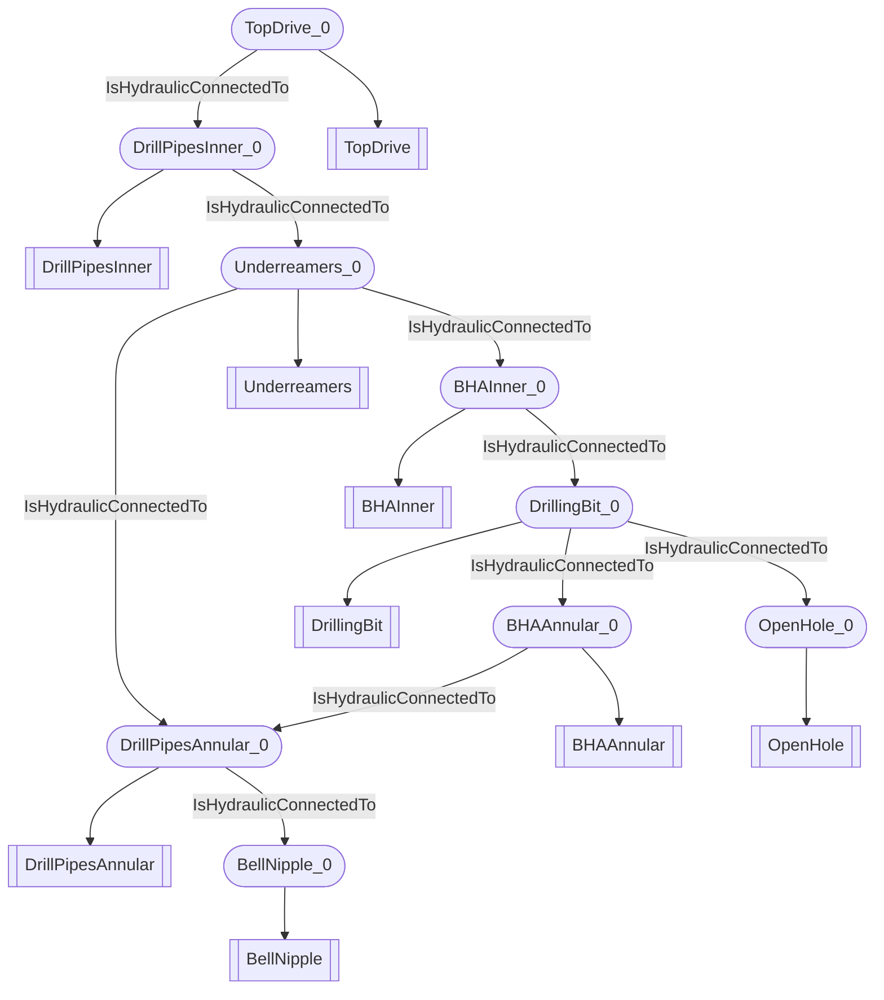

# Sub surface hydraulic
- DrillPipesAnnular:DrillPipesAnnular_0
- BellNipple:BellNipple_0
- BHAAnnular:BHAAnnular_0
- DrillingBit:DrillingBit_0
- OpenHole:OpenHole_0
- BHAInner:BHAInner_0
- DrillPipesInner:DrillPipesInner_0
- Underreamers:Underreamers_0
- TopDrive:TopDrive_0
- DrillPipesAnnular_0 IsHydraulicConnectedTo BellNipple_0
- BHAAnnular_0 IsHydraulicConnectedTo DrillPipesAnnular_0
- DrillingBit_0 IsHydraulicConnectedTo BHAAnnular_0
- DrillingBit_0 IsHydraulicConnectedTo OpenHole_0
- BHAInner_0 IsHydraulicConnectedTo DrillingBit_0
- DrillPipesInner_0 IsHydraulicConnectedTo Underreamers_0
- TopDrive_0 IsHydraulicConnectedTo DrillPipesInner_0
- Underreamers_0 IsHydraulicConnectedTo DrillPipesAnnular_0
- Underreamers_0 IsHydraulicConnectedTo BHAInner_0

